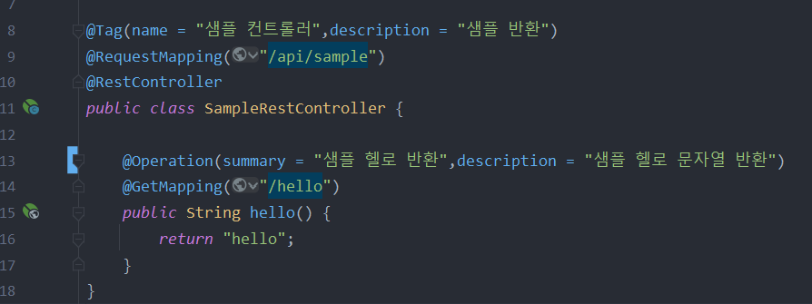

# 사용법

1. 의존성 설정
```groovy
    implementation group: 'org.springdoc', name: 'springdoc-openapi-ui', version: '1.6.1'
```

2. application.properties 설정
```groovy
   springdoc.api-docs.path=/api-docs
   springdoc.swagger-ui.path-/swagger-ui.html
   springdoc-swagger-ui.disable-swagger-default-url=true
   springdoc.swagger-ui.diplay-query-params-without-oauth2=false
   springdoc.packages-to-scan=org.roon.club
```

3. 컨트롤러에 설정
 
   
4. http://localhost:8080/swagger-ui.html 접속
